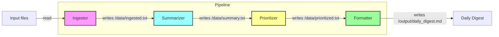

# Multi-Agent Digest

A multi-agent AI pipeline that turns raw input documents into a clean daily digest.

This project demonstrates how to build a specialized overnight assistant chain using four Python agents, containerized with Docker, and orchestrated with Docker Compose.

## What does this project do, and why did you build it?

This project reads text inputs, summarizes them, ranks the most important items, and formats the result into a polished daily brief.

Why it exists:
- To show how to split a workflow into focused agents, each responsible for one step.
- To make the pipeline portable and repeatable by containerizing each agent.
- To teach the pattern of chaining micro-services with shared data volumes and Docker Compose.

The “overnight team” concept is:
- `ingestor` reads raw source files,
- `summarizer` extracts key facts,
- `prioritizer` ranks what matters most,
- `formatter` builds the output digest.

## Architecture

The pipeline is implemented as four Docker services managed by `docker-compose.yaml`.

Mermaid diagram:



### Service roles

- `ingestor`: reads files from `data/input` and writes combined text to `data/ingested.txt`
- `summarizer`: summarizes the ingested text into key bullets in `data/summary.txt`
- `prioritizer`: ranks summary lines and writes the results to `data/prioritized.txt`
- `formatter`: converts ranked lines into `output/daily_digest.md`

### Data flow

- `data/input` → `data/ingested.txt`
- `data/ingested.txt` → `data/summary.txt`
- `data/summary.txt` → `data/prioritized.txt`
- `data/prioritized.txt` → `output/daily_digest.md`

## How do I run this locally?

### Requirements

- Docker Engine
- Docker Compose
- Optional: an OpenAI API key if you want to use the remote OpenAI path instead of the local Ollama fallback

### Start locally

1. Copy the environment template:

```bash
copy .env.example .env
```

2. Edit `.env` if you need to set `OPENAI_API_KEY` or change `ENABLE_LLM_LOCALLY`.

3. Build and run the pipeline:

```bash
docker compose up --build
```

4. When the pipeline completes, open the generated digest:

```bash
more output\daily_digest.md
```

### Running a Local LLM (with Ollama)

The OpenAI API can be replaced by a locally hosted model through Ollama. With Ollama, open-source language models are made available on your machine, where tasks such as downloading model weights, managing memory, and exposing an API are automatically taken care of.

#### Getting Ollama Ready:

- **Install Ollama (macOS or Linux)**  
  ```bash
  curl -fsSL https://ollama.com/install.sh | sh
  ```

- **Fetch a Model (for example, `llama3` as a versatile option)**  
  ```bash
  ollama run llama3
  ```

- **Confirm It’s Running**  
  ```bash
  ollama ps
  ```

---

### Notes

- Input files should be placed in `data/input/`
- The pipeline is designed to run end-to-end in sequence using Docker Compose service dependencies
- `summarizer` supports a local LLM path via `OLLAMA_BASE_URL` if `ENABLE_LLM_LOCALLY=TRUE`

## How do I deploy it?

This project deploys as a Docker Compose stack.

### Simple deployment

```bash
docker compose up -d --build
```

### Production considerations

- Run the same Compose file on any machine with Docker
- Mount a persistent volume for `data` and `output`
- Add logging/monitoring and secrets management for `OPENAI_API_KEY`
- Use a CI/CD pipeline to rebuild images and deploy updates

## What decisions did you make, and why?

- `Four agents`: each stage is isolated so the pipeline is easy to understand and extend.
- `Docker Compose`: it makes it simple to run the full workflow with one command.
- `Shared data volumes`: agents communicate via files, avoiding complex RPC or message queue setup.
- `Python`: keeps each agent lightweight and easy to modify.
- `Local LLM fallback`: the summarizer can use a local Ollama endpoint, which improves portability and avoids requiring a cloud API key in every environment.

## What would you improve if you continued working on it?

- Add automated tests for each agent and end-to-end pipeline validation
- Replace file-based communication with a queue or event-driven orchestration for better reliability
- Add retries and stronger error handling across service boundaries
- Add a scheduler to run the digest automatically overnight
- Add either an email sender or web UI for digest delivery
- Add metrics, logging aggregation, and observability
- Support richer input sources such as RSS, email, or APIs

## Project structure

- `agents/ingestor/app.py` — reads raw inputs
- `agents/summarizer/app.py` — summarizes text
- `agents/prioritizer/app.py` — scores and ranks insights
- `agents/formatter/app.py` — creates the final markdown digest
- `docker-compose.yaml` — orchestrates the four containers
- `data/` — shared pipeline data and input files
- `output/` — generated `daily_digest.md`

---

Built to show how to convert digital noise into an organized daily brief using a containerized multi-agent AI pipeline.